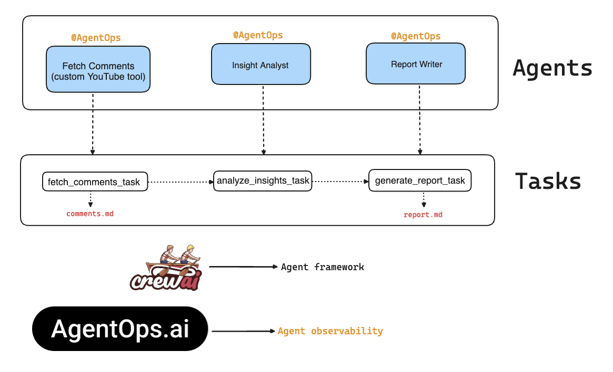

# YoutubeYapperTrapper Crew

Welcome to the YoutubeYapperTrapper Crew project, powered by [crewAI](https://crewai.com) + [AgentOps for observability](https://www.agentops.ai/) + [YouTube Data API](https://developers.google.com/youtube/v3/docs/comments/list). This project allows agents to take a given YouTube URL, extracts all the comments, and generates a final report with insights to inform better content creation.

## Crew architecture diagram



## Video tutorial

<a href="https://youtu.be/SFXlvPo-CEs">
  
</a>

## Installation

Ensure you have Python >=3.10 <=3.13 installed on your system. This project uses [Poetry](https://python-poetry.org/) for dependency management and package handling, offering a seamless setup and execution experience.

First, if you haven't already, install Poetry:

```bash
pip install poetry
```

Next, navigate to your project directory and install the dependencies:

1. First lock the dependencies and then install them:

```bash
poetry lock
```

```bash
poetry install
```

### Customizing

**Add your `OPENAI_API_KEY` into the `.env` file if you want to use it.**

- Modify `src/youtube_yapper_trapper/config/agents.yaml` to define your agents
- Modify `src/youtube_yapper_trapper/config/tasks.yaml` to define your tasks
- Modify `src/youtube_yapper_trapper/crew.py` to add your own logic, tools and specific args
- Modify `src/youtube_yapper_trapper/main.py` to add custom inputs for your agents and tasks

## Running the Project

Rename the `.env_example` file to `.env`, add your API keys, and save the file.

To kickstart your crew of AI agents and begin task execution, run this from the root folder of your project:

```bash
poetry run youtube_yapper_trapper
```

This command initializes the youtube-yapper-trapper Crew, assembling the agents and assigning them tasks as defined in your configuration.

This example, unmodified, will run the create a `report.md` file with the output of a research on LLMs in the root folder.

## Understanding Your Crew

The youtube-yapper-trapper Crew is composed of multiple AI agents, each with unique roles, goals, and tools. These agents collaborate on a series of tasks, defined in `config/tasks.yaml`, leveraging their collective skills to achieve complex objectives. The `config/agents.yaml` file outlines the capabilities and configurations of each agent in your crew.

## Support

For support, questions, or feedback regarding the YoutubeYapperTrapper crew, CrewAI, or AgentOps.

- Visit CrewAI [documentation](https://docs.crewai.com)
- Reach out to me through my [GitHub repository](https://github.com/tonykipkemboi/youtube-yapper-trapper)
- [Joing CrewAI Discord](https://discord.com/invite/X4JWnZnxPb)
- [Chat wtih CrewAI docs](https://chatg.pt/DWjSBZn)
- [Check out AgentOps!](https://www.agentops.ai/)
- Also don't forget to [subscribe to my channel](https://www.youtube.com/@tonykipkemboi) for more awesome content!

Let's create wonders together with the power and simplicity of CrewAI.
